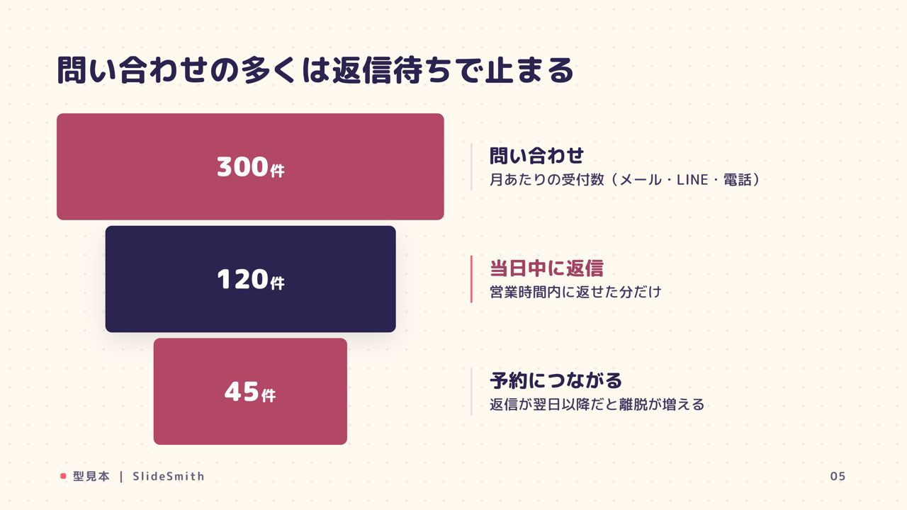
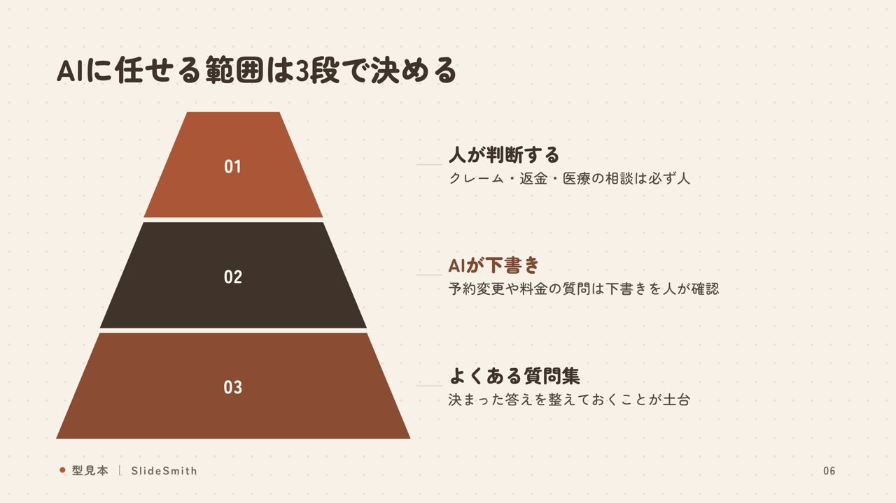
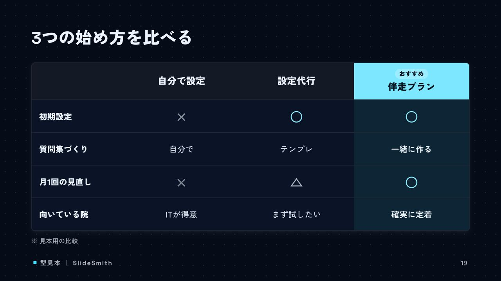
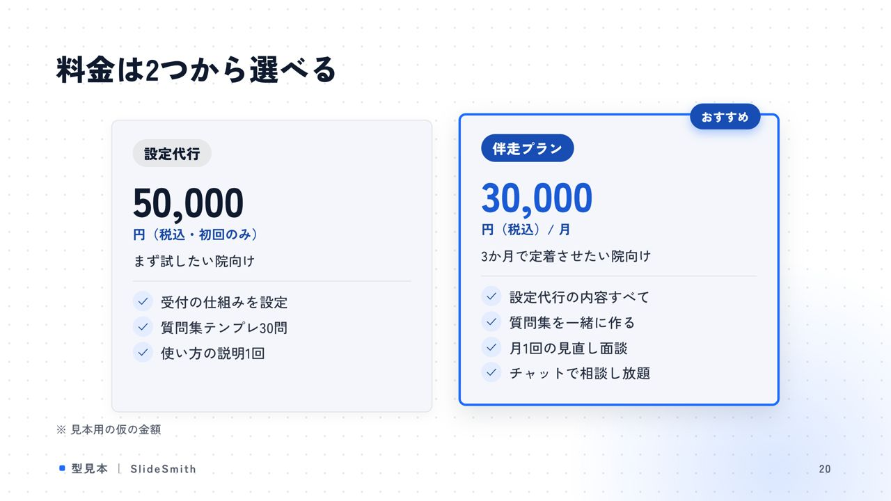
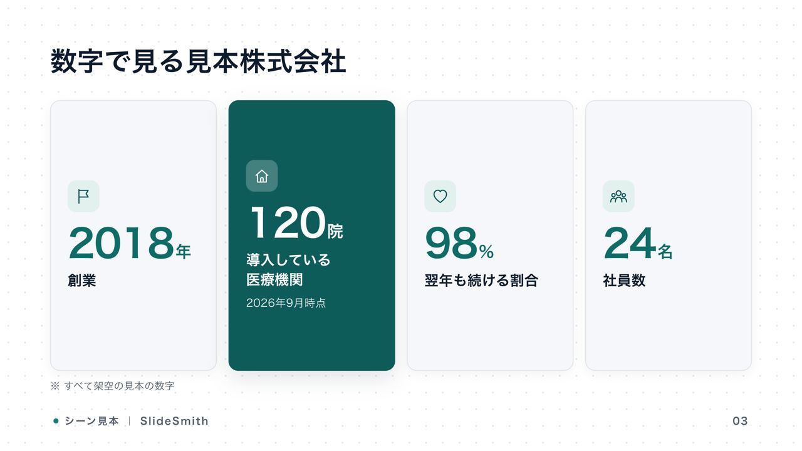
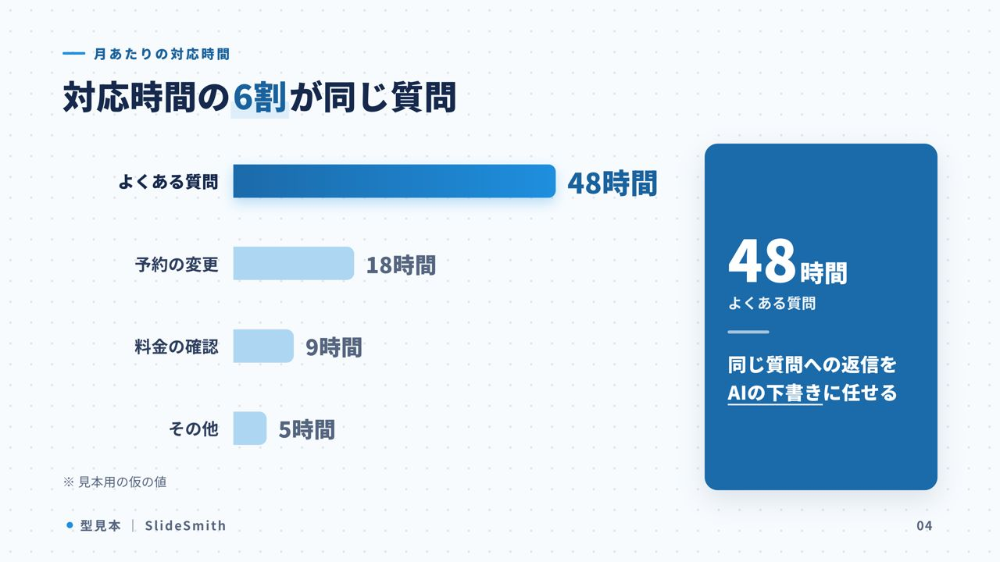
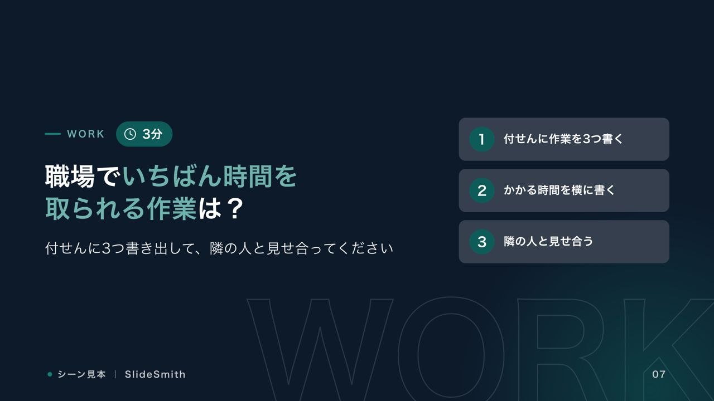

# SlideSmith

**台本を渡すと、崩れない16:9スライドを作る Claude Code スキル**

メモや箇条書きの台本を渡すと、Claude Code が場面に合った構成を考え、29種の「型」から選んで文字を埋めます。
配置・サイズ・色はスクリプトが決めるので、AIが座標を触ることはありません。
描画したあとは機械で検品し、別のAIが採点します。合格したら 4K PNG / PDF / 編集できる PPTX に書き出します。


- **型が29種** — 表紙・比較・手順・グラフ・表・料金・ピラミッド・2×2・ファネル・お客様の声・問いかけ／ワークなど
- **テーマが11種** — ビジネス／ポップ／高級／ミニマル／テック／ナチュラル／フェミニン／レトロ／爽やか／ダイナミック／ツートン
- **場面別の構成レシピが8種** — 営業提案・セミナー・会社説明・社内報告・ピッチ・イベント告知・研修・事例紹介
- **描く前に止める** — 文字数オーバー、同じ型が3枚続く、図解が少ない、中身の無いグラフ、中身の無い章扉などを、エラー文と直し方つきで知らせます
- **描いたあとに測る** — はみ出し・重なり・文字の小ささ・コントラスト・余白の偏り・画像の欠けをピクセル単位で検査します
- **別のAIが採点する** — 作り手とは別のエージェントが画像を見て採点し、直す場所を指示します（最大2回まで、一番良い版を採用）
- **安いモデルでも動くように作ってある** — 手順書はチェックリスト形式で、台本→deck.json→完成画像の見本つき

## ギャラリー

どれも架空の台本から自動で作ったものです。

| ファネル（pop） | ピラミッド（warm） |
|---|---|
|  |  |

| 比較表（tech） | 料金（duotone） |
|---|---|
|  |  |

| キーメッセージ（dynamic） | 数字で見る（corporate） |
|---|---|
|  |  |

| グラフ（fresh） | 問いかけ・ワーク（corporate） |
|---|---|
|  |  |

**全29型の一覧**


**場面別の見本**（講座・会社説明など）


**セミナー資料の見本**（`reference/examples/cafe-workshop`）


## はじめかた

### 必要なもの

| もの | 何に使う？ | 入手先 |
|------|-----------|--------|
| **Claude Code** | このスキルを動かすAI | [claude.com/claude-code](https://claude.com/claude-code) |
| **Node.js**（18以上） | 描画スクリプト（プログラム）を動かす | [nodejs.org](https://nodejs.org/ja) の「LTS」 |
| **Google Chrome** | スライドを画像にするブラウザ | [google.com/chrome](https://www.google.com/chrome/) |

### 1. 入れる（最初の1回だけ）

ターミナルに次の1行を貼って Enter を押します。

```bash
git clone https://github.com/Icchaso/auto-slide.git ~/.claude/skills/slidesmith && cd ~/.claude/skills/slidesmith && npm install
```

Windows の場合は、保存先を `%USERPROFILE%\.claude\skills\slidesmith` に読み替えてください。

### 2. Claude Code に頼む

```
スライド作って。セミナー用で、テーマはおまかせ。内容はこれ↓
（台本やメモを貼る）
```

「営業提案」「研修」などの場面を書くと、その場面に合ったレシピで構成を考えます。

### 3. 直したいとき

「3枚目を比較の形にして」「もっと派手なテーマで」のように言葉で頼めば、deck.json を直して描き直します。

## 仕組み

```
台本
 └─ ① 構成を決める … 場面レシピ（reference/scenes.md）と型の決定表（reference/layouts.md）から選ぶ
 └─ ② deck.json を書く … 型ごとの枠に文字を入れるだけ（文字数の上限つき）
 └─ ③ 事前チェック   … node scripts/build.mjs decks/<名前> --check
 └─ ④ 描画＋機械検品 … node scripts/build.mjs decks/<名前>
 └─ ⑤ 目で確認＋採点 … 別のエージェントが reference/reviewer.md の基準で採点（最大2回）
 └─ ⑥ 書き出し       … --pdf / --pptx
```

AIに毎回HTMLを手書きさせると、上位モデルでも崩れることがあり、安いモデルだとさらに崩れます。
SlideSmith では AI の仕事を「言葉を選ぶ・型を選ぶ・評価する」の3つだけにしました。
見た目を決めるのはスクリプトで、品質は機械で測っています。

### deck.json の例

```json
{
  "theme": "corporate",
  "brand": "サービス名 ｜ 会社名",
  "slides": [
    { "layout": "cover", "title": "問い合わせの返信を*当日中*にそろえる", "subtitle": "AI下書きの導入提案" },
    { "layout": "big-number", "title": "返信の半分が翌日以降になっている", "value": "52", "unit": "%", "label": "翌日以降に返信した問い合わせ",
      "body": "営業時間外に届いた分が、ほぼそのまま翌日に回っている" }
  ]
}
```

枠の名前と上限は `reference/layouts.md` に載っています（コードから自動で作っているので、実装とずれません）。
完全な見本は `reference/examples/` の2組です。

## 主なコマンド

```bash
node scripts/build.mjs decks/<名前> --check   # 事前チェックだけ（速い）
node scripts/build.mjs decks/<名前>           # 描画 → 4K PNG ＋ 機械検品（out/qc-report.json）
node scripts/build.mjs decks/<名前> --pdf     # PDFも出す
node scripts/build.mjs decks/<名前> --pptx    # 文字を編集できるPPTXも出す
node scripts/pptx-preview.mjs <ファイル>.pptx   # PPTXをKeynoteで実際に描画して確認（macOS）
node scripts/layouts-doc.mjs                  # 型の一覧 reference/layouts.md を作り直す
```

PPTX は、背景と図形を画像にして、その上に文字を編集できるテキストボックスとして重ねています。
見た目は PNG と同じまま、PowerPoint・Keynote・Canva で文字を直せます。

### AIで写真を作る（任意）

```bash
node scripts/genimg.mjs "会議室で話すチーム" decks/<名前>/assets/team.jpg --style corporate --ar 16:9 --free    # 無料
node scripts/genimg.mjs "会議室で話すチーム" decks/<名前>/assets/team.jpg --style corporate --ar 16:9           # Gemini
node scripts/genimg.mjs "会議室で話すチーム" decks/<名前>/assets/team.jpg --style corporate --ar 16:9 --openai  # gpt-image
```

APIキーは `node scripts/setup-gemini.mjs` / `node scripts/setup-openai.mjs` を自分のターミナルで実行して登録します。
入力した文字は画面に出ず、シェル履歴（打ったコマンドの記録）にも残りません。

## どのモデルで動かすか

同じ台本を使い、モデルごとに作らせたデッキを、どのデッキがどのモデル製か伏せた状態で採点しました（2本で実測）。

| 作り手 | 必須ゲート | 総合点 | 合格 |
|--------|-----------|--------|------|
| Opus | 全合格 | 88（この方式）/ 87（旧・手書き） | 2本とも合格 |
| Sonnet | 全合格 | 87 / 83 | 1本合格 |
| Haiku | 1本で違反 | 77 / 78 | 不合格 |

採点で見つかった崩れのうち、Haiku の「値がすべて同じグラフ」と Sonnet の「中身の無い章扉」は、今は事前チェックで止まるようにしてあります。
おすすめは **Sonnet 以上**です。採点役にも Sonnet 以上を使ってください。

## フォルダ構成

```
slidesmith/
├── SKILL.md              # Claude Code が読む手順書（チェックリスト）
├── engine/               # 型の定義（layouts.mjs）・事前チェック・PPTX書き出し
├── core/engine.css       # 型の見た目（AIは触らない）
├── themes/               # 11テーマ ＋ 新テーマの作り方（THEME_GUIDE.md）
├── scripts/              # build（描画）・qc（検品）・genimg（写真）など
├── reference/
│   ├── layouts.md        # 型の決定表と枠の一覧（自動生成）
│   ├── scenes.md         # 場面別の構成レシピ8種
│   ├── rubric.md         # 採点表
│   ├── reviewer.md       # 採点役への指示
│   └── examples/         # 台本 → deck.json → 完成画像 の見本
├── examples/             # 旧方式（HTML手書き・8型PPTX）の見本
└── decks/                # 作ったスライドはここに入る（Gitの管理外）
```

2026年9月より前の旧方式（`core/layouts.md` ＋ `scripts/render.mjs`、8型の `scripts/pptx.mjs`）も、互換のために残しています。

## ライセンス

MIT。商用利用・改変・再配布ができます。

フォントは [Google Fonts](https://fonts.google.com/) を使っていて、それぞれのフォントのライセンスに従います。
Built with [Claude Code](https://claude.com/claude-code).
